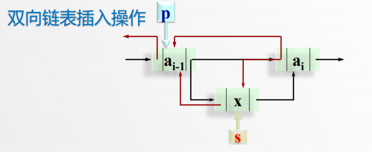
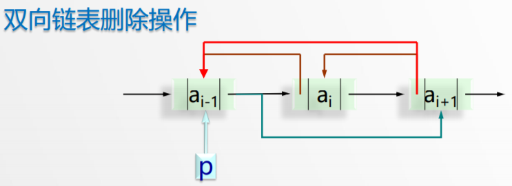
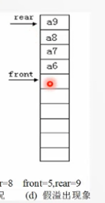
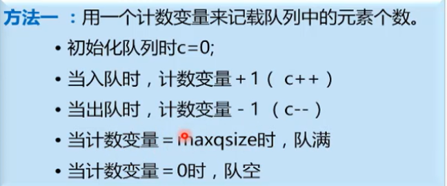
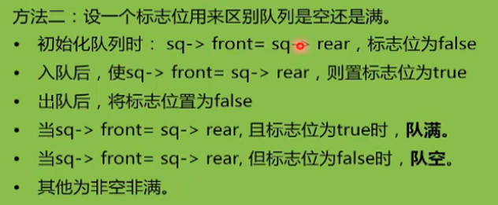
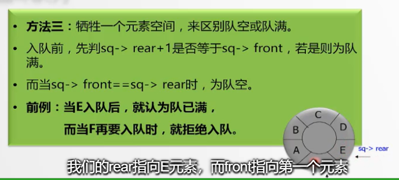

### 链表的各种形式
-----
（一般都会选择加头结点，以保证对头结点的操作和后面各种操作一致，减少操作复杂度）  
1. 带尾指针的循环单链表  
        1）将两个循环单链表合并；  
        2）以及经常需要在最后一个元素后添加寻元素和在第一个元素前插入新元素  
        原因: 循环链表中，尾节点的下一个结点是头结点，由于在链表中，找一个结点的后继比前驱容易，因此尾节点易找到头结点。  
  
2. 双向链表（找前后节点一样容易 但增加了结构性开销）  
        此时要注意的是删除和插入时 两个指针均要变动  
        **插入**操作：代码如下：(ai-1,ai)插入p结点
		**顺序一定是不能变动的** 指针操作尤为注意！
		
```c++
s->next = p->next;  
p->next = s;  
s->next->prior;  
s->prior = p;
```
**删除**操作（比较容易实现）


```
		p->next = p->next->next;
		p->next->prior = p;
```

以上操作都必须注意：关键点是，指针的变化要从**后面**那个开始，因为一旦把前面的一个的next变了，那也就将整个链表丢失了。

------

### 元素插入位置问题

|  带头结点单链表   |   顺序表 |  
| --- |
|  在**头部**做插入时间复杂度最小   |  在**尾部**插入时间复杂度最小   | 
|  存放数据时最好倒着放   |  正着放就行   |    
-------------

##### 关于链表基本操作实现的注意点 
1. 判断链表是否存在；
2. 判断所要定位的位置是否合法（只能在1~length之间）；
3. 前两步都符合再开始定位。

------
### 链表头结点的问题 #####
不带头结点 | 带头结点
-------------|-------------
链表头指针存放第一个结点的数据 | 不存放数据 有时可存放链表信息
空链表时头指针指针域为NULL | head->next==NULL
\ | 头结点永远存在
**基本操作时要区分头结点和后面结点** | **不必区分**

------
==问题描述+算法思想+算法步骤 伪代码+性能分析==

### 分析链式存储与顺序存储时要注意的点 
&emsp; 在相同的时间复杂度的情况下，究竟使用哪一种呢？  
&emsp; 此时要考虑的不仅仅是时间复杂度，还有具体步骤的开销。
&emsp; 链表大部分时间花费在定位上，**关键步骤（如插入删除）开销不大**
&emsp; 而顺序表在关键步骤花费很大的话，那也不考虑使用。

-------
### 栈的实现问题 
*链表实现* &emsp; 由于栈只需要在栈顶进行插入与删除操作，又由于链表的特细，**在表头更容易插入删除**（常数时间），所以通常采用**链表头部作为栈顶**。

==栈通常都是采用链表存储，不用预先估计大小，且所有操作都是常数级别的==

&emsp; 应用：括号配对

------
### 队列的实现问题
&emsp; 为了便于后续操作，通常将队首指针指向**首元素的前一个位置**，尾指针指向尾元素。
&emsp;（后面指针的操作中也经常会出现**快慢指针** 的方法）
&emsp; 空队列：rear=front=-1；
&emsp; **假溢出现象**：顺序表实现中，队尾指针到达了顺序表末尾，但顺序表开头还有剩余空间；

&emsp; 解决方法：循环队列，每次入队出队对数组长度*取模*。
&emsp; 那此时怎么判断队列是满还是空呢？




**链表实现**
入队操作（只能在队尾哦）
```
px=new Qnode;
px->data=x;
px->next=NULL;

Q->rear->next=px; ---最关键
Q->rear=px;
```
出队操作（在队首 很简单哦）
```
tempP=Q->front->next;
Q->front->next=Q->front->next->next;
delete tempP;
```
当最后一个元素出队后，rear指针指向哪？**头结点**